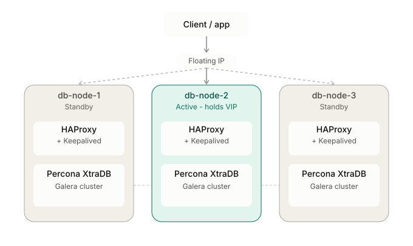

# High Availability Implementation Task (Percona + HAProxy + Keepalived) 🔗💽⚡

## Architecture

The client connects to a single **floating (virtual) IP address** — never to any node's real IP directly.

That VIP is bound, at any given moment, to whichever node is currently active. Keepalived owns that binding: it uses VRRP to assign the VIP to one node's network interface, and moves it to another node automatically if the active node fails its health check.



On the node holding the VIP, HAProxy is what's actually listening on that IP (port 3306). The real connection path is:

`Client → Floating IP → HAProxy (on whichever node currently holds the VIP) → one of the 3 Percona nodes (chosen by HAProxy's backend health check)`

HAProxy's backend check verifies each Percona node is actually synced with the cluster (`wsrep_local_state_comment = Synced`), not just reachable — so traffic never lands on a node that's up but out of sync.

## VM Installation

Create **3 virtual machines** and install **Debian 13** on each.

Assign the following roles:

- db-node-1
- db-node-2
- db-node-3

## Set Up Percona XtraDB Cluster

### Network Configuration

> ⚠️ Do this on **each VM**.

1. Edit the network configuration

```bash
sudo vim /etc/network/interfaces
```

2. Configure a static IP

```ini
auto enp0s3

iface enp0s3 inet static
    address 192.168.86.X
    netmask 255.255.255.0
    gateway 192.168.86.1
    dns-nameservers 8.8.8.8 1.1.1.1
```

3. Assign IP addresses — replace `X` with the value below on each node

| VM        | IP             |
| --------- | -------------- |
| db-node-1 | 192.168.86.101 |
| db-node-2 | 192.168.86.102 |
| db-node-3 | 192.168.86.103 |

4. Apply the configuration

```bash
sudo systemctl restart networking
```

If the changes are not applied correctly:

```bash
sudo reboot
```

### Hostname Configuration

> ⚠️ Each node must have a unique hostname.

Set hostname:

```bash
sudo hostnamectl set-hostname db-node-1
```

Use the following values:

| VM        | Hostname  |
| --------- | --------- |
| db-node-1 | db-node-1 |
| db-node-2 | db-node-2 |
| db-node-3 | db-node-3 |

### `/etc/hosts` Configuration

> ⚠️ Required for cluster communication. This file is **identical on all 3 nodes**.

```text
192.168.86.101 db-node-1
192.168.86.102 db-node-2
192.168.86.103 db-node-3
```

### Install Percona XtraDB Cluster

> ⚠️ Run on **all nodes**.

```bash
sudo apt update
sudo apt install -y wget gnupg2 lsb-release curl

wget https://repo.percona.com/apt/percona-release_latest.generic_all.deb
sudo dpkg -i percona-release_latest.generic_all.deb

sudo apt update
sudo percona-release setup pxc-84-lts

sudo apt install -y percona-xtradb-cluster
```

During installation, you will be prompted to set the MySQL root password.

> ⚠️ Use the **same strong password on all three nodes**.

### Configure Percona XtraDB Cluster (Without SSL Encryption)

1. Configure each node

Edit:

```bash
sudo vim /etc/mysql/mysql.conf.d/mysqld.cnf
```

Add or replace the following configuration:

```ini
[mysqld]
mysqlx=OFF
server-id=<node-num>

wsrep_provider=/usr/lib/galera4/libgalera_smm.so

wsrep_cluster_address=gcomm://192.168.86.101,192.168.86.102,192.168.86.103
wsrep_cluster_name=pxc-cluster

wsrep_node_name=pxc-node-<node-num>
wsrep_node_address=192.168.86.10X
pxc_strict_mode=ENFORCING

wsrep_sst_method=xtrabackup-v2

pxc-encrypt-cluster-traffic=OFF
```

> Replace `<node-num>` with `1`, `2`, or `3`, and replace `X` in the IP address with the corresponding node number.

2. Start the cluster

> ⚠️ Bootstrap is **only** used to create a brand-new cluster from nothing. Only ever run it on **one** node.

**db-node-1 — bootstrap**

```bash
sudo systemctl start mysql@bootstrap
```

**db-node-2 and db-node-3 — normal start (join via SST)**

```bash
sudo systemctl start mysql
```

3. Verify the Cluster

Run on any node:

```bash
mysql -u root -p -e "SHOW STATUS LIKE 'wsrep_cluster_size';"
```

Check node state:

```bash
mysql -u root -p -e "SHOW STATUS LIKE 'wsrep_local_state_comment';"
```

Expected output:

```text
wsrep_cluster_size = 3
wsrep_local_state_comment = Synced
```

### Enable SSL Encryption (Optional)

**db-node-1**

1. Generate the CA key and certificate

```bash
mkdir ~/ssl-certs && cd ~/ssl-certs

openssl genrsa 2048 > ca-key.pem
openssl req -new -x509 -nodes -days 3650 \
  -key ca-key.pem -out ca.pem \
  -subj "/CN=PXC-Cluster-CA"
```

2. Generate the server private key and CSR:

```bash
openssl req -newkey rsa:2048 -nodes -days 3650 \
  -keyout server-key.pem \
  -out server-req.pem \
  -subj "/CN=pxc-server"
```

> ⚠️ Do NOT use the same Common Name you used for your CA certificate.

3. Generate the server certificate:

```bash
openssl x509 -req -in server-req.pem \
  -CA ca.pem -CAkey ca-key.pem \
  -set_serial 01 -days 3650 \
  -out server-cert.pem
```

4. Send the key and certificate files to the other two nodes:

```bash
scp ca.pem server-cert.pem server-key.pem <user>@192.168.86.102:/tmp/
scp ca.pem server-cert.pem server-key.pem <user>@192.168.86.103:/tmp/
```

5. Move certificates into place on db-node-1:

```bash
mkdir -p /etc/mysql/certs
mv ~/ssl-certs/ca.pem ~/ssl-certs/server-key.pem ~/ssl-certs/server-cert.pem /etc/mysql/certs/
chown -R mysql:mysql /etc/mysql/certs
```

**db-node-2 and db-node-3**

1. Install the certs sent from db-node-1

```bash
mkdir -p /etc/mysql/certs
mv /tmp/ca.pem /tmp/server-key.pem /tmp/server-cert.pem /etc/mysql/certs/
chown -R mysql:mysql /etc/mysql/certs
```

**All 3 Nodes**

1. Update the MySQL config

```bash
sudo vim /etc/mysql/mysql.conf.d/mysqld.cnf
```

> Same substitution rules as the non-SSL config above — keep `server-id`, `wsrep_node_name`, and `wsrep_node_address` unique per node:

```ini
[mysqld]
mysqlx=OFF
server-id=<node-num>

wsrep_provider=/usr/lib/galera4/libgalera_smm.so

wsrep_provider_options="socket.ssl=yes;socket.ssl_key=/etc/mysql/certs/server-key.pem;socket.ssl_cert=/etc/mysql/certs/server-cert.pem;socket.ssl_ca=/etc/mysql/certs/ca.pem;"

wsrep_cluster_address=gcomm://192.168.86.101,192.168.86.102,192.168.86.103
wsrep_cluster_name=pxc-cluster

wsrep_node_name=pxc-node-<node-num>
wsrep_node_address=192.168.86.10X
pxc_strict_mode=ENFORCING

wsrep_sst_method=xtrabackup-v2

ssl-key=/etc/mysql/certs/server-key.pem
ssl-ca=/etc/mysql/certs/ca.pem
ssl-cert=/etc/mysql/certs/server-cert.pem

[sst]
encrypt=4
ssl-key=/etc/mysql/certs/server-key.pem
ssl-ca=/etc/mysql/certs/ca.pem
ssl-cert=/etc/mysql/certs/server-cert.pem
```

2. Start the Cluster with SSL

**db-node-1 — bootstrap**

```bash
sudo systemctl start mysql@bootstrap
```

**db-node-2 and db-node-3 — normal start**

```bash
sudo systemctl start mysql
```

### Important Notes About Cluster State

All nodes in the same **Galera / Percona XtraDB Cluster** share the same **cluster UUID (state UUID)**. This UUID is generated automatically during the first bootstrap and then shared across all nodes.

Only one node can be used to bootstrap the cluster.

Before starting a node, check:

```bash
cat /var/lib/mysql/grastate.dat
```

| Node                           | Expected `safe_to_bootstrap` |
| ------------------------------ | ---------------------------- |
| The bootstrap node (db-node-1) | `1`                          |
| All other nodes                | `0`                          |

> ⚠️ Do NOT manually change this value during normal operations. It is only touched during cluster recovery after an unclean shutdown.

#### Restarting the Cluster Safely

Once the cluster is up and synced, restarting nodes is **not** the same as the first-time bootstrap. Do it in this order so you never lose quorum or corrupt state.

1. **db-node-3** — stop it first (not the reference node)

```bash
sudo systemctl stop mysql
```

2. **db-node-2** — stop it next

```bash
sudo systemctl stop mysql
```

At this point db-node-1 is the only node left running. It's still serving traffic alone (`wsrep_cluster_size = 1`), and its clean shutdown state marks it as the safe reference node.

3. **db-node-1** — confirm it's the safe node, then restart it as a fresh bootstrap (as the last man standing, a plain `restart mysql` will hang trying to reach peers that aren't there anymore)

```bash
cat /var/lib/mysql/grastate.dat   # confirm safe_to_bootstrap: 1
sudo systemctl restart mysql@bootstrap
```

4. **db-node-2** — start normally, it will IST/SST-sync from db-node-1

```bash
sudo systemctl start mysql
```

5. **db-node-3** — start normally, same as above

```bash
sudo systemctl start mysql
```

6. Verify again with the `wsrep_cluster_size` / `wsrep_local_state_comment` checks above — expect `3` and `Synced`.

> ⚠️ Never run `mysql@bootstrap` on more than one node at the same time — that creates two separate clusters (split brain) instead of one.
> ⚠️ Never bootstrap a node whose `grastate.dat` shows `safe_to_bootstrap: 0` unless you're doing a documented crash-recovery procedure (`mysqld --wsrep-recover`).

## Set Up HAProxy

### Install HAProxy

> Use the HAProxy version provided by your supported operating system repositories.

```bash
sudo apt update
sudo apt install haproxy
```

### Cluster Healthcheck

1. Login to MySQL

```bash
mysql -u root -p
```

2. Create a user for the cluster healthcheck

```mysql
CREATE USER '<clustercheck-user>'@'localhost' IDENTIFIED BY '<clustercheck-password>';

GRANT PROCESS ON *.* TO '<clustercheck-user>'@'localhost';

FLUSH PRIVILEGES;
```

> You can use the default user and password (user: `clustercheckuser`, password: `clustercheckpassword!`)

3. Verify the user was created

```mysql
SELECT user, host FROM mysql.user WHERE user = "clustercheckuser";
```

4. Verify the script itself works

> On PXC 8.4, `clustercheck` is provided by the `percona-xtradb-cluster-client` package (or a separate `percona-clustercheck` package depending on version).

Run on this node:

```bash
clustercheck
```

If you set a different user and password:

```bash
clustercheck <clustercheck-user> <clustercheck-password>
```

`clustercheck` also accepts these optional parameters, in order:

- `user` / `password` (default `clustercheckuser` / `clustercheckpassword!`): credentials for the check. Pass `""` for either to use an empty value.
- `available_when_donor` (default 0): by default, a node acting as SST donor is reported unavailable. Set to 1 to allow queries on a donor node — requires a non-blocking SST method like xtrabackup.
- `log_file` (default `/dev/null`): where check logs/errors go.
- `available_when_readonly` (default 1): whether a node in `read_only` mode is still reported available.
- `defaults_extra_file` (default `/etc/my.cnf`): passed to the underlying `mysql` command via `--defaults-extra-file`. **Use this to store the check credentials instead of passing them as plain arguments** — otherwise the password ends up readable in the systemd unit file below.

5. Expose the check over HTTP with systemd

Create the socket unit:

```bash
sudo vim /etc/systemd/system/mysqlchk.socket
```

```ini
[Unit]
Description=Percona XtraDB Cluster Node Healthcheck Socket

[Socket]
ListenStream=9200
Accept=yes

[Install]
WantedBy=sockets.target
```

Create the matching service template:

```bash
sudo vim /etc/systemd/system/mysqlchk@.service
```

```ini
[Unit]
Description=Percona XtraDB Cluster Node Healthcheck Service

[Service]
ExecStart=-/usr/bin/clustercheck
StandardInput=socket
StandardOutput=socket
```

> Credentials aren't passed on the command line here — instead, put them in a `defaults_extra_file` (e.g. `/etc/my.cnf.local`, root-readable only) so they never appear in the unit file or in `ps` output.

6. Reload systemd so it picks up the new units

```bash
sudo systemctl daemon-reload
```

7. Enable and start the socket

```bash
sudo systemctl enable --now mysqlchk.socket
```

8. Verify it's listening and responding

```bash
sudo ss -ltnp | grep 9200
curl localhost:9200
```

> Run all of the steps above on every cluster node, except step 2 (creating the clustercheck user) — that only needs to run once, since it replicates to all nodes automatically via the cluster.

### Configure HAProxy

1. Create the configuration file

```bash
sudo vim /etc/haproxy/haproxy.cfg
```

2. Configure simple load balancing between nodes

```ini
global
    log 127.0.0.1 local0
    maxconn 4096
    user haproxy
    group haproxy
    daemon

defaults
    log     global
    mode    tcp
    option  dontlognull
    retries 3
    timeout connect 5s
    timeout client  50s
    timeout server  50s

listen mysql-cluster
    bind *:3307
    mode tcp
    option httpchk
    balance roundrobin
    server db01 192.168.86.101:3306 check port 9200 inter 12000 rise 3 fall 3
    server db02 192.168.86.102:3306 check port 9200 inter 12000 rise 3 fall 3
    server db03 192.168.86.103:3306 check port 9200 inter 12000 rise 3 fall 3
```

* **global**
	- `log 127.0.0.1 local0` — sends HAProxy's logs to the local syslog daemon, tagged under facility `local0`.
	- `maxconn 4096` — maximum total simultaneous connections HAProxy will accept across everything.
	- `user haproxy` / `group haproxy` — drops root privileges after startup; runs as the unprivileged `haproxy` system user instead.
	- `daemon` — runs HAProxy as a background daemon process rather than in the foreground.

* **defaults**
	- `log global` — use the logging target defined in the `global` section for everything below.
	- `mode tcp` — treat traffic as raw TCP.
	- `option dontlognull` — don't log connections that transferred zero data, keeps logs from filling with noise.
	- `retries 3` — how many times HAProxy retries connecting to a backend server before considering that attempt failed.
	- `timeout connect 5s` — max time to wait while establishing a connection to a backend server.
	- `timeout client 50s` — max time to wait for data from the client side before timing out an idle connection.
	- `timeout server 50s` — max time to wait for data from the backend server side before timing out.

* **listen mysql-cluster**
	- `bind *:3307` — listen on port 3307 on all interfaces of this node. Port 3307 avoids clashing with the local MySQL/Percona instance already using 3306.
	- `mode tcp` — explicit here too.
	- `option httpchk` — health checks go over HTTP, not plain TCP.
	- `balance roundrobin` — cycles each new connection across the 3 servers in turn, spreading load evenly across all nodes.
	- `server db0X <ip>:3306` — the real Percona node this entry points to, on MySQL's actual port 3306.
	- `check` — enables active health checking for this server.
	- `port 9200` — the health check is sent to port 9200, where the `clustercheck` systemd socket listens, reporting true Galera sync state.
	- `inter 12000` — runs the health check every 12,000ms (12 seconds).
	- `rise 3` — a DOWN server needs 3 consecutive successful checks before HAProxy marks it UP.
	- `fall 3` — an UP server needs 3 consecutive failed checks before HAProxy marks it DOWN.

3. Check the configuration file syntax

```bash
sudo haproxy -c -f /etc/haproxy/haproxy.cfg
```

4. Apply it via systemd

```bash
sudo systemctl restart haproxy
```

5. Make sure it starts on boot

```bash
sudo systemctl enable haproxy
```

## Set up KeepaliveD

### Install KeepaliveD

```bash
sudo apt update
sudo apt install keepalived
```

### Configure KeepaliveD

1. Create the configuration file

```bash
sudo vim /etc/keepalived/keepalived.conf
```

2. Configure the Primary Node (db-node-1)

```ini
global_defs {
    router_id db-node-1
}

vrrp_script check_haproxy {
    script "killall -0 haproxy"
    interval 2
    weight -20
}

vrrp_instance VI_1 {
    state MASTER
    interface enp0s3
    virtual_router_id 51
    priority 150
    advert_int 1
    authentication {
        auth_type PASS
        auth_pass secret
    }
    virtual_ipaddress {
        192.168.86.100
    }
    track_script {
        check_haproxy
    }
}
```

3. Configure the Backup Nodes (db-node-2, db-node-3)

```ini
global_defs {
    router_id <node-hostname>
}

vrrp_script check_haproxy {
    script "killall -0 haproxy"
    interval 2
    weight -20
}

vrrp_instance VI_1 {
    state BACKUP
    interface enp0s3
    virtual_router_id 51
    priority <priority>
    advert_int 1
    authentication {
        auth_type PASS
        auth_pass secret
    }
    virtual_ipaddress {
        192.168.86.100
    }
    track_script {
        check_haproxy
    }
}
```

> `virtual_router_id` and `VI_1` must be **identical on all 3 nodes** — this is what groups them into the same VRRP election, not a per-node value.
> Give each backup a distinct `priority` lower than the master (e.g. `150` / `100` / `90`), so there's a clear takeover order if more than one node is a candidate at the same time.
> Replace `<node-hostname>` with each node's own hostname — this is just a label for logs, unrelated to VRRP grouping.

4. Allow HAProxy to bind to an IP not yet present on the interface

> ⚠️ Required on **all 3 nodes**. The VIP only lives on whichever node is currently MASTER — without this setting, HAProxy on the BACKUP nodes will fail to start once it's bound to the VIP instead of `*`.

```bash
echo "net.ipv4.ip_nonlocal_bind=1" | sudo tee /etc/sysctl.d/99-haproxy-vip.conf
sudo sysctl --system
sysctl net.ipv4.ip_nonlocal_bind
```

5. Set the VIP in the HAProxy configuration file

Edit

```bash
sudo vim /etc/haproxy/haproxy.cfg
```

Replace the `bind *` address with the virtual address used by Keepalived

```ini
bind 192.168.86.100:3307
```

Check syntax and apply

```bash
sudo haproxy -c -f /etc/haproxy/haproxy.cfg
sudo systemctl restart haproxy
```

6. Start Keepalived

```bash
sudo systemctl start keepalived
```

7. Enable Keepalived at boot

```bash
sudo systemctl enable keepalived
```

8. Verify the VIP

```bash
ip addr show enp0s3
```

## Validate Database Connectivity via VIP

### Create an Application User

> The default MySQL user only has `@'localhost'`, so it can only connect from a session running directly on that node. HAProxy runs in `mode tcp` and forwards traffic using its own node IP as the connection source — not `localhost` and not the original client's IP — so a separate user is needed for connections coming through HAProxy.

1. Login to MySQL

```bash
mysql -u root -p
```

2. Create the user, allowed from any node in the cluster's subnet

```mysql
CREATE USER 'appuser'@'192.168.86.%' IDENTIFIED BY '<password>';

GRANT ALL PRIVILEGES ON *.* TO 'appuser'@'192.168.86.%';

FLUSH PRIVILEGES;
```

> Only run this once, on any single node — like the clustercheck user, it replicates to all 3 nodes automatically via the cluster.

### Test the Connection Through the VIP

```bash
mysql -h 192.168.86.100 -P 3307 -u appuser -p -e "SELECT 1;"
```

## Failover Testing

### Test 1

1. Stop KeepaliveD from Master Node

```bash
sudo systemctl stop keepalived
```

2. Check VIP

```bash
ip addr show enp0s3
```

It must be not displayed in MASTER node, but displayed in node with priority is highest.

### Test 2

1. Shutdown VM

```bash
sudo shutdown -h now
```

2. Check VIP (on remaining nodes)

```bash
ip addr show enp0s3
```

VIP must appear on the node with the next highest priority. Check DB connectivity through the VIP:

```bash
mysql -h 192.168.86.100 -P 3307 -u appuser -p -e "SELECT 1;"
```

3. Restart the shutdown VM, confirm it rejoins as BACKUP

```bash
sudo systemctl status keepalived
sudo systemctl status mysql
```

### Test 3

1. Restart HAProxy on Master Node

```bash
sudo systemctl restart haproxy
```

2. Check VIP

```bash
ip addr show enp0s3
```

3. Check DB connectivity through the VIP during and after the restart

```bash
mysql -h 192.168.86.100 -P 3307 -u appuser -p -e "SELECT 1;"
```

VIP should either stay on the same node (if HAProxy recovers before `check_haproxy` fails enough times) or move to the next highest-priority node — either way, the DB connection through the VIP must not require manual intervention.

### Test 4

1. Simulate network loss on Master Node

```bash
sudo ip link set enp0s3 down
```

2. Check VIP (on remaining nodes)

```bash
ip addr show enp0s3
```

VIP must appear on the node with the next highest priority.

3. Restore the network

```bash
sudo ip link set enp0s3 up
```

4. Confirm the node rejoins as BACKUP, not fighting for MASTER

```bash
sudo systemctl status keepalived
```

## Security & Stability

### Minimal Permissions

HAProxy already runs as the unprivileged `haproxy` user (set in `global`). Confirm it:

```bash
ps -eo user,cmd | grep haproxy
```

Check the clustercheck service isn't running as root:

```bash
systemctl status mysqlchk@*
```

Check Keepalived's systemd unit:

```bash
systemctl cat keepalived
```

> Keepalived requires elevated network privileges to manage interfaces and send VRRP packets — it cannot run fully unprivileged. This is expected, not a gap.

Confirm the `appuser` MySQL account is scoped to specific host IPs and specific privileges (see note above), not `*.*` or a subnet wildcard.

### No Open or Unused Ports

Check listening ports on all 3 nodes:

```bash
sudo ss -tulnp
```

Expected ports:

| Port | Purpose                             |
| ---- | ----------------------------------- |
| 3306 | MySQL / Galera client connections   |
| 3307 | HAProxy frontend (bound to the VIP) |
| 9200 | Clustercheck (HTTP healthcheck)     |
| 4567 | Galera group communication          |
| 4444 | Galera SST                          |

Confirm no other ports are listening. Confirm firewall rules restrict 9200 and the Galera ports (4444/4567) to the cluster's internal subnet only — they have no reason to be reachable from outside the 3 nodes.

### Firewall

> Restrict cluster-internal ports (Galera, clustercheck) to the 3 node IPs only. Only the client-facing VIP port and SSH should be reachable more broadly.

Install and enable ufw on all 3 nodes:

```bash
sudo apt install -y ufw
```

Allow SSH first, before enabling ufw, to avoid locking yourself out:

```bash
sudo ufw allow 22/tcp
```

Allow cluster-internal traffic only from the other 2 nodes' IPs (repeat for each peer IP, run on all 3 nodes):

```bash
sudo ufw allow from 192.168.86.101 to any port 3306 proto tcp
sudo ufw allow from 192.168.86.102 to any port 3306 proto tcp
sudo ufw allow from 192.168.86.103 to any port 3306 proto tcp

sudo ufw allow from 192.168.86.101 to any port 4567 proto tcp
sudo ufw allow from 192.168.86.102 to any port 4567 proto tcp
sudo ufw allow from 192.168.86.103 to any port 4567 proto tcp

sudo ufw allow from 192.168.86.101 to any port 9200 proto tcp
sudo ufw allow from 192.168.86.102 to any port 9200 proto tcp
sudo ufw allow from 192.168.86.103 to any port 9200 proto tcp
```

Allow VRRP traffic between nodes (Keepalived uses protocol 112, not TCP/UDP):

```bash
sudo ufw allow from 192.168.86.101 proto vrrp
sudo ufw allow from 192.168.86.102 proto vrrp
sudo ufw allow from 192.168.86.103 proto vrrp
```

Allow the client-facing port from your application's subnet (adjust to your actual client network):

```bash
sudo ufw allow from 192.168.86.0/24 to any port 3307 proto tcp
```

Enable ufw:

```bash
sudo ufw enable
sudo ufw status verbose
```

### Startup on Reboot

Confirm all required services are enabled:

```bash
sudo systemctl is-enabled mysql haproxy keepalived mysqlchk.socket
```

Reboot each node one at a time and confirm after each reboot:
- Percona rejoins the cluster (`wsrep_cluster_size` back to 3, `wsrep_local_state_comment = Synced`)
- HAProxy is running and health-checking (`systemctl status haproxy`)
- Keepalived comes back up in the correct state (MASTER/BACKUP as expected by priority)
